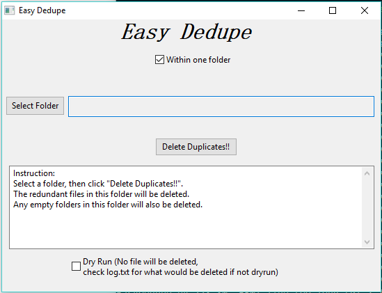
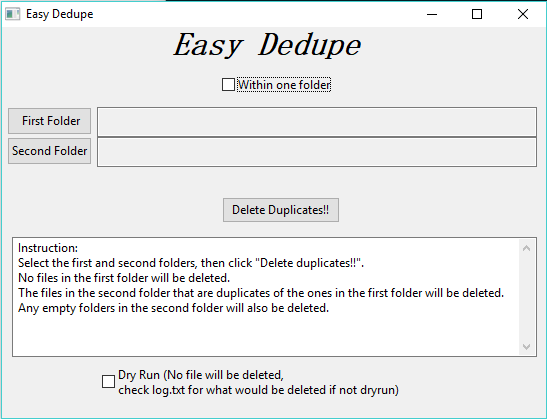

# EasyDedupe
Easily remove redundant files.

## Usage
Just download EasyDedupe.exe from [releases](https://github.com/wensheng/EasyDedupe/releases) and run it.

There are two modes of operation: one is 'single folder mode', the other is 'double folder mode' (default).
 

In single folder mode, you select a single folder, when you click "Delete Duplicates!!" button, EasyDedupe will find redundant files and delete them.

In double folder mode, you select 2 folders, EasyDedupe will find files in the second folders that are duplicates of the files in the first folder and delete them.  In other words, no files in the first folder will be deleted, only redundant files in the second folder will be.

If you are afraid that EasyDedupe will delete wrong files(very unlikely), you can check "Dry Run" checkbox at the bottom, no files will then be deleted.  You can check log file for the duplicate files that EasyDedupe finds, you can do whatever you want to do with them manually.

## Build

EasyDedupe use wxPython.

In Windows cmd.exe:

    rem py34 is conda env name that created by 'conda create -n py34 python=3.4'
    activate py34 
    pip install pyinstaller
    pyinstaller --onefile --windowd EasyDedupe.py
